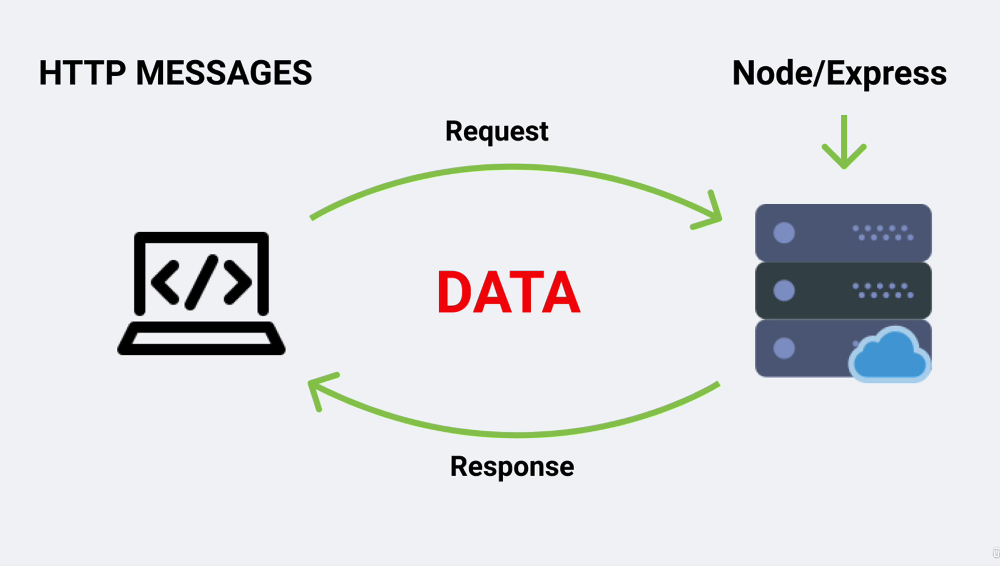

# Section 4: Express

#### 51 [HTTP Request/Response Cycle](#51)

#### 52 [HTTP Messages](#52)

#### 53 [Starter Project Info](#53)

#### 54 [Starter Project Install](#54)

#### 55 [Starter Overview](#55)

#### 56 [HTTP - Basics](#56)

#### 57 [HTTP - Headers](#57)

#### 58 [HTTP - Request Object](#58)

#### 59 [HTTP - HTML File](#59)

#### 60 [HTTP - App Example](#60)

#### 61 [Express Info](#61)

#### 62 [Express Basics](#62)

#### 63 [Express - App Example](#63)

#### 64 [Express - All Static](#64)

#### 65 [API VS SSR](#65)

#### 66 [JSON - Basics](#66)

#### 67 [Params, Query String - Setup](#67)

#### 68 [Params](#68)

#### 69 [Params - Extra Info](#69)

#### 70 [Query String](#70)

#### 71 [Additional Params and Query String Info](#71)

#### 72 [Middleware - Setup](#72)

#### 73 [APP.USE](#73)

#### 74 [Multiple Middleware Functions](#74)

#### 75 [Additional Middleware Info](#75)

#### 76 [Methods - GET](#76)

#### 77 [Methods - POST (Setup)](#77)

#### 78 [Methods - POST (Form Example)](#78)

#### 79 [Methods - POST (Javascript Example)](#79)

#### 80 [Install Postman](#80)

#### 81 [Methods - PUT](#81)

#### 82 [Methods - DELETE](#82)

#### 83 [Express Router - Setup](#83)

#### 84 [Express Router - Controllers](#84)

---

<br>

### 51 HTTP Request/Response Cycle<a id='51'></a>



- [Course API's](https://course-api.com/slides.html)

<br>

### 52 HTTP Messages<a id='52'></a>

- go to [Course API's](https://course-api.com)
- open dev tool-> Network (reload page)
- click on any file for instance "course-api.com", notice message
  - request url:
  - request method:
  - statur code:
  - remote address:
  - etc...

<br>

### 53 Starter Project Info<a id='53'></a>

<br>

### 54 Starter Project Install<a id='54'></a>

<br>

### 55 Starter Overview<a id='55'></a>

- from final-folder copy code and paste to app.js
- Navigate to project folder where package.json is and run

```sh
npm install
```

<br>

### 56 HTTP - Basics<a id='56'></a>

- create app.js-file, write server on it

```js
const http = require("http");

// everytime user hit the server callback will invoke
const server = http.createServer((req, res) => {
  console.log("user hit the server");
  res.end("Home page");
});

server.listen(5000);
```

- ref [Port (computer networking)](<https://en.wikipedia.org/wiki/Port_(computer_networking)>)

<br>

### 57 HTTP - Headers<a id='57'></a>

- create app.js-file, write server on it

```js
const http = require("http");

const server = http.createServer((req, res) => {
  // tell browser the status code & mime type i.e html file we are sending
  res.writeHead(200, { "content-type": "text/html" });
  res.write("<h1>home page</h1>");
  res.end();
});

server.listen(5000);
```

- ref [HTTP response status codes](https://developer.mozilla.org/en-US/docs/Web/HTTP/Status)
- ref [Multipurpose Internet Mail Extensions or MIME type (IANA media types)](https://developer.mozilla.org/en-US/docs/Web/HTTP/Basics_of_HTTP/MIME_types)

<br>

### 58 HTTP - Request Object<a id='58'></a>

- create app.js-file, write server on it

```js
const http = require("http");

const server = http.createServer((req, res) => {
  // console.log(req) - the giant object
  // console.log(req.method);

  // what resource user is looking for
  const url = req.url;

  // home page
  if (url === "/") {
    res.writeHead(200, { "content-type": "text/html" });
    res.write("<h1>home page</h1>");
    res.end();
  }
  // about page
  else if (url === "/about") {
    res.writeHead(200, { "content-type": "text/html" });
    res.write("<h1>about page</h1>");
    res.end();
  }
  // 404
  else {
    res.writeHead(404, { "content-type": "text/html" });
    res.write("<h1>page not found</h1>");
    res.end();
  }
});

server.listen(5000);
```

<br>

### 59 HTTP - HTML File<a id='59'></a>

- create index.html, make it home page

```html
<!DOCTYPE html>
<html lang="en">
  <head>
    <meta charset="UTF-8" />
    <meta name="viewport" content="width=device-width, initial-scale=1.0" />
    <title>Document</title>
  </head>
  <body>
    <h1>home page</h1>
    <h6>hello world</h6>
  </body>
</html>
```

---

- create app.js-file, write server on it

```js
const http = require("http");

// require readfilesync() filesystem
const { readFileSync } = require("fs");

// get all files
const homePage = readFileSync("./index.html");

const server = http.createServer((req, res) => {
  // console.log(req.method)
  const url = req.url;
  console.log(url);

  // home page
  if (url === "/") {
    // res.writeHead(200, { "content-type": "text/plain" });
    res.writeHead(200, { "content-type": "text/html" });
    res.write(homePage);
    res.end();
  }
  // about page
  else if (url === "/about") {
    res.writeHead(200, { "content-type": "text/html" });
    res.write("<h1>about page</h1>");
    res.end();
  }
  // 404
  else {
    res.writeHead(404, { "content-type": "text/html" });
    res.write("<h1>page not found</h1>");
    res.end();
  }
});

server.listen(5000);
```

<br>

### 60 HTTP - App Example<a id='60'></a>

- serving navbar(files) from folder
- create app.js-file, write server on it

```js
const http = require("http");
const { readFileSync } = require("fs");

// get all files
const homePage = readFileSync("./navbar-app/index.html");
const homeStyles = readFileSync("./navbar-app/styles.css");
const homeImage = readFileSync("./navbar-app/logo.svg");
const homeLogic = readFileSync("./navbar-app/browser-app.js");

const server = http.createServer((req, res) => {
  // console.log(req.method)
  const url = req.url;
  console.log(url);

  // home page
  if (url === "/") {
    // media type html
    res.writeHead(200, { "content-type": "text/html" });
    res.write(homePage);
    res.end();
  }
  // about page
  else if (url === "/about") {
    // media type html
    res.writeHead(200, { "content-type": "text/html" });
    res.write("<h1>about page</h1>");
    res.end();
  }
  // styles
  else if (url === "/styles.css") {
    // media type css
    res.writeHead(200, { "content-type": "text/css" });
    res.write(homeStyles);
    res.end();
  }
  // image/logo
  else if (url === "/logo.svg") {
    // media type image
    res.writeHead(200, { "content-type": "image/svg+xml" });
    res.write(homeImage);
    res.end();
  }
  // logic
  else if (url === "/browser-app.js") {
    // media type javascript
    res.writeHead(200, { "content-type": "text/javascript" });
    res.write(homeLogic);
    res.end();
  }
  // 404
  else {
    // media type html
    res.writeHead(404, { "content-type": "text/html" });
    res.write("<h1>page not found</h1>");
    res.end();
  }
});

server.listen(5000);
```

<br>

### 61 Express Info<a id='61'></a>

- Install express recent version

```sh
npm install express --save
```

<br>

- Install express specific version

```sh
npm install express@4.17.1 --save
```

<br>

### 62 Express Basics<a id='62'></a>

- create app.js-file, write server on it

```js
const express = require("express");

// create app server aka object
const app = express();

// home
app.get("/", (req, res) => {
  console.log("user hit the resource");
  res.status(200).send("Home Page");
});

// about
app.get("/about", (req, res) => {
  res.status(200).send("About Page");
});

// 404: * means anything user ask from url
// eg: http://localhost:5000/xyz/dbz/anime
app.all("*", (req, res) => {
  res.status(404).send("<h1>resource not found</h1>");
});

app.listen(5000, () => {
  console.log("server is listening on port 5000...");
});

// app.get
// app.post
// app.put
// app.delete
// app.all
// app.use
// app.listen
```

<br>

### 63 Express - App Example<a id='63'></a>

- create app.js-file, write server on it
- create public-folder and move browser-app.js, logo.svg, styles.css files in it from navbar-app folder

```js
const express = require("express");
const path = require("path");

const app = express();

// setup static and middleware
app.use(express.static("./public"));

app.get("/", (req, res) => {
  res.sendFile(path.resolve(__dirname, "./navbar-app/index.html"));
});

app.all("*", (req, res) => {
  res.status(404).send("page not found");
});

app.listen(5000, () => {
  console.log("server is listening on port 5000....");
});
```

<br>

### 64 Express - All Static<a id='64'></a>

- create app.js-file, write server on it
- create public-folder and move index.html, browser-app.js, logo.svg, styles.css files in it from navbar-app folder

```js
const express = require("express");
const path = require("path");

const app = express();

// setup static and middleware
// public folder serving navbar
app.use(express.static("./public"));

app.all("*", (req, res) => {
  res.status(404).send("resource not found");
});

app.listen(5000, () => {
  console.log("server is listening on port 5000....");
});
```

<br>

### 65 API VS SSR<a id='65'></a>

<br>

### 66 JSON - Basics<a id='66'></a>

- create app.js-file, write server on it

```js
const express = require("express");
const app = express();

// import json data
const { products } = require("./data");

app.get("/", (req, res) => {
  // how to respond json to user
  // res.json([{ name: "john" }, { name: "peter" }]);
  res.json(products);
});

app.listen(5000, () => {
  console.log("Server is listening on port 5000....");
});
```

- ref [res.json](https://expressjs.com/en/4x/api.html#res.json)

<br>

### 67 Params, Query String - Setup<a id='67'></a>

- create app.js-file, write server on it

```js
const express = require("express");
const app = express();
const { products } = require("./data");

// home page or route
app.get("/", (req, res) => {
  res.send('<h1> Home Page</h1><a href="/api/products">products</a>');
});

// internet address or route- /api/products
app.get("/api/products", (req, res) => {
  // how to respond selective data from json by destructuring
  const newProducts = products.map((product) => {
    const { id, name, image } = product;
    return { id, name, image };
  });

  res.json(newProducts);
});

app.listen(5000, () => {
  console.log("Server is listening on port 5000....");
});
```

<br>

### 68 Params<a id='68'></a>

- create app.js-file, write server on it

```js
const express = require("express");
const app = express();

// import dummy json data
const { products } = require("./data");

// home page route
app.get("/", (req, res) => {
  res.send('<h1> Home Page</h1><a href="/api/products">products</a>');
});
app.get("/api/products", (req, res) => {
  const newProducts = products.map((product) => {
    const { id, name, image } = product;
    return { id, name, image };
  });

  res.json(newProducts);
});

// how to define placeholder aka params aka wildcard aka dynamic link
app.get("/api/products/:productID", (req, res) => {
  // console.log(req)
  // console.log(req.params)

  // destructuring placeholder aka params
  const { productID } = req.params;

  // how to find object in json using find()
  // note- Number() to convert string into number
  const singleProduct = products.find(
    (product) => product.id === Number(productID)
  );

  // if singleProduct is undefine
  if (!singleProduct) {
    return res.status(404).send("Product Does Not Exist");
  }

  return res.json(singleProduct);
});

app.listen(5000, () => {
  console.log("Server is listening on port 5000....");
});
```

<br>

### 69 Params - Extra Info<a id='69'></a>

- create app.js-file, write server on it

```js
const express = require("express");
const app = express();
const { products } = require("./data");

// home route
app.get("/", (req, res) => {
  res.send('<h1> Home Page</h1><a href="/api/products">products</a>');
});

// /api/products route -product listing
app.get("/api/products", (req, res) => {
  const newProducts = products.map((product) => {
    const { id, name, image } = product;
    return { id, name, image };
  });

  res.json(newProducts);
});

// /api/products/:productID -placeholder route aka wildcard
app.get("/api/products/:productID", (req, res) => {
  // console.log(req)
  // console.log(req.params)
  const { productID } = req.params;

  const singleProduct = products.find(
    (product) => product.id === Number(productID)
  );
  if (!singleProduct) {
    return res.status(404).send("Product Does Not Exist");
  }

  return res.json(singleProduct);
});

// complex route with two params aka placeholder aka wildcard i.e :productID & :reviewID
app.get("/api/products/:productID/reviews/:reviewID", (req, res) => {
  console.log(req.params);
  res.send("hello world");
});

app.listen(5000, () => {
  console.log("Server is listening on port 5000....");
});
```

<br>

### 70 Query String parameter or url parameter<a id='70'></a>

- create app.js-file, write server on it

```js
const express = require("express");
const app = express();
const { products } = require("./data");

/* home route */
app.get("/", (req, res) => {
  res.send('<h1> Home Page</h1><a href="/api/products">products</a>');
});

/* product listing route */
app.get("/api/products", (req, res) => {
  const newProducts = products.map((product) => {
    const { id, name, image } = product;
    return { id, name, image };
  });

  res.json(newProducts);
});

/* product detail route */
app.get("/api/products/:productID", (req, res) => {
  // console.log(req)
  // console.log(req.params)
  const { productID } = req.params;

  const singleProduct = products.find(
    (product) => product.id === Number(productID)
  );
  if (!singleProduct) {
    return res.status(404).send("Product Does Not Exist");
  }

  return res.json(singleProduct);
});

/* complex product detail route */
app.get("/api/products/:productID/reviews/:reviewID", (req, res) => {
  console.log(req.params);
  res.send("hello world");
});

// query string route -filter */
app.get("/api/v1/query", (req, res) => {
  // console.log(req.query)

  // destructure query string
  const { search, limit } = req.query;

  // copy products items in new array
  let sortedProducts = [...products];

  // filter product name
  if (search) {
    sortedProducts = sortedProducts.filter((product) => {
      return product.name.startsWith(search);
    });
  }

  // filter product list
  if (limit) {
    sortedProducts = sortedProducts.slice(0, Number(limit));
  }

  // when their no item in array
  if (sortedProducts.length < 1) {
    // res.status(200).send('no products matched your search');
    return res.status(200).json({ sucess: true, data: [] });
  }

  res.status(200).json(sortedProducts);
});

app.listen(5000, () => {
  console.log("Server is listening on port 5000....");
});
```

---

- Go to localhost

```sh
# filter only two result
http://localhost:3000/api/v1/query?limit=2

# filter result that have 'a' in their name
http://localhost:3000/api/v1/query?search=a

# filter result that have 'a' in their name & only show two result
http://localhost:3000/api/v1/query?search=a&limit=1

#  when item dont exit in array
http://localhost:3000/api/v1/query?search=unknown
```

<br>

### 71 Additional Params and Query String Info<a id='71'></a>

- to make server error free, always send one respond to one request.
- use return in if-blocks

<br>

### 72 Middleware - Setup<a id='72'></a>

- create app.js-file, write server on it

```js
const express = require("express");
const app = express();

//  req => middleware => res

// custom logger function, we'll be using as middleware
const logger = (req, res, next) => {
  const method = req.method;
  const url = req.url;
  const time = new Date().getFullYear();
  console.log(method, url, time);
  // we always have to use next() middleware-fun
  next();
};

// How to pass middleware i.e logger, in get() method in home route
app.get("/", logger, (req, res) => {
  res.send("Home");
});

// How to pass middleware i.e logger, in get() method in about route
app.get("/about", logger, (req, res) => {
  res.send("About");
});

app.listen(5000, () => {
  console.log("Server is listening on port 5000....");
});
```

<br>

### 73 APP.USE<a id='73'></a>

- create logger.js-file, put middleware on it

```js
const logger = (req, res, next) => {
  const method = req.method;
  const url = req.url;
  const time = new Date().getFullYear();
  console.log(method, url, time);
  next();
};

module.exports = logger;
```

---

- create app.js-file, write server on it

```js
const express = require("express");
const app = express();

// import logger middleware
const logger = require("./logger");

//  req => middleware => res
// How to use logger-middleware in every route
app.use(logger);

// How to use logger-middleware on specific route
// note- api/home/about/products    -this will work on every route started with api/
// app.use('/api', logger);

app.get("/", (req, res) => {
  res.send("Home");
});

app.get("/about", (req, res) => {
  res.send("About");
});

app.get("/api/products", (req, res) => {
  res.send("Products");
});

app.get("/api/items", (req, res) => {
  res.send("Items");
});

app.listen(5000, () => {
  console.log("Server is listening on port 5000....");
});
```

<br>

### 74 Multiple Middleware Functions<a id='74'></a>

<br>

### 75 Additional Middleware Info<a id='75'></a>

<br>

### 76 Methods - GET<a id='76'></a>

- create app.js-file, write server on it
- get method- READ data

```js
const express = require("express");
const app = express();

// import json data
let { people } = require("./data");

// route /api/people
app.get("/api/people", (req, res) => {
  // send json payload from the file
  res.status(200).json({ success: true, data: people });
});

app.listen(5000, () => {
  console.log("Server is listening on port 5000....");
});
```

<br>

### 77 Methods - POST (Setup)<a id='77'></a>

- create app.js-file, write server on it
- use middleware to serve static files

```js
const express = require("express");
const app = express();

// import json data
let { people } = require("./data");

// serve static assets i.e form
app.use(express.static("./methods-public"));

app.get("/api/people", (req, res) => {
  // send json payload from the file
  res.status(200).json({ success: true, data: people });
});

app.listen(5000, () => {
  console.log("Server is listening on port 5000....");
});
```

<br>

### 78 Methods - POST (Form Example)<a id='78'></a>

- create app.js-file, write server on it
- use middleware to serve static files

```js
const express = require("express");
const app = express();
let { people } = require("./data");

// serve static assets i.e form
app.use(express.static("./methods-public"));

// parse form data (to encode form data)
app.use(express.urlencoded({ extended: false }));

app.get("/api/people", (req, res) => {
  // send json payload from the file
  res.status(200).json({ success: true, data: people });
});

/* POST request from front end */
app.post("/login", (req, res) => {
  const { name } = req.body;

  // if user fill his/her name
  if (name) {
    return res.status(200).send(`Welcome ${name}`);
  }

  // when user forget fill his/her name
  res.status(401).send("Please Provide Credentials");
});

app.listen(5000, () => {
  console.log("Server is listening on port 5000....");
});
```

<br>

### 79 Methods - POST (Javascript Example)<a id='79'></a>

- create app.js-file, write server on it
- use static frontend form -javascript

```js
const express = require("express");
const app = express();
let { people } = require("./data");

// static assets
app.use(express.static("./methods-public"));
// parse form data
app.use(express.urlencoded({ extended: false }));
// parse json- middleware for handing incoming json data by user to server
app.use(express.json());

app.get("/api/people", (req, res) => {
  res.status(200).json({ success: true, data: people });
});

/* route */
app.post("/api/people", (req, res) => {
  //  destructure post data using json middleware
  const { name } = req.body;

  // if name is undefine
  if (!name) {
    return res
      .status(400)
      .json({ success: false, msg: "please provide name value" });
  }

  res.status(201).json({ success: true, person: name });
});

// POST request from front end
app.post("/login", (req, res) => {
  const { name } = req.body;

  // if user fill his/her name
  if (name) {
    return res.status(200).send(`Welcome ${name}`);
  }

  // when user forget fill his/her name
  res.status(401).send("Please Provide Credentials");
});
app.listen(5000, () => {
  console.log("Server is listening on port 5000....");
});
```

<br>

### 80 Install Postman<a id='80'></a>

- How to make a post request from postman

  - make a post request with url
  - select tab body-> raw-> switch to 'JSON', type in textbox

  ```js
  {
    "name": "jhon"
  }
  ```

  - click on send

---

```js
const express = require("express");
const app = express();
let { people } = require("./data");

// static assets
app.use(express.static("./methods-public"));
// parse form data
app.use(express.urlencoded({ extended: false }));
// parse json
app.use(express.json());

app.get("/api/people", (req, res) => {
  res.status(200).json({ success: true, data: people });
});

app.post("/api/people", (req, res) => {
  const { name } = req.body;
  if (!name) {
    return res
      .status(400)
      .json({ success: false, msg: "please provide name value" });
  }
  res.status(201).json({ success: true, person: name });
});

/* postman  */
app.post("/api/postman/people", (req, res) => {
  const { name } = req.body;
  if (!name) {
    return res
      .status(400)
      .json({ success: false, msg: "please provide name value" });
  }
  res.status(201).json({ success: true, data: [...people, name] });
});

app.post("/login", (req, res) => {
  const { name } = req.body;
  if (name) {
    return res.status(200).send(`Welcome ${name}`);
  }

  res.status(401).send("Please Provide Credentials");
});

app.listen(5000, () => {
  console.log("Server is listening on port 5000....");
});
```

<br>

### 81 Methods - PUT<a id='81'></a>

<br>

### 82 Methods - DELETE<a id='82'></a>

<br>

### 83 Express Router - Setup<a id='83'></a>

<br>

### 84 Express Router - Controllers<a id='84'></a>

<br>
```
